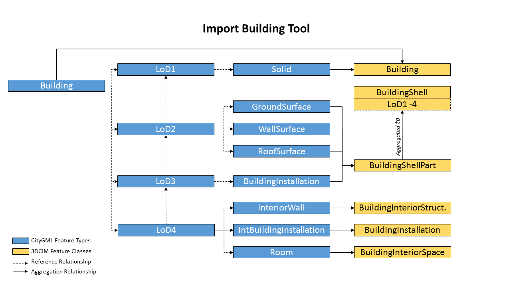
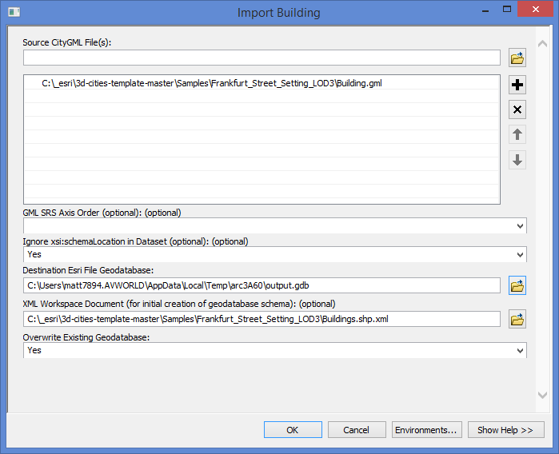
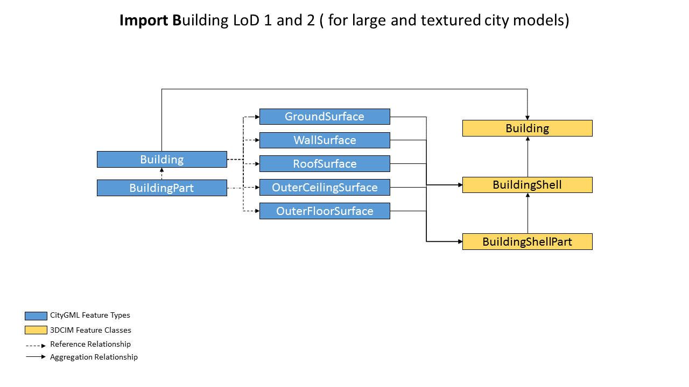
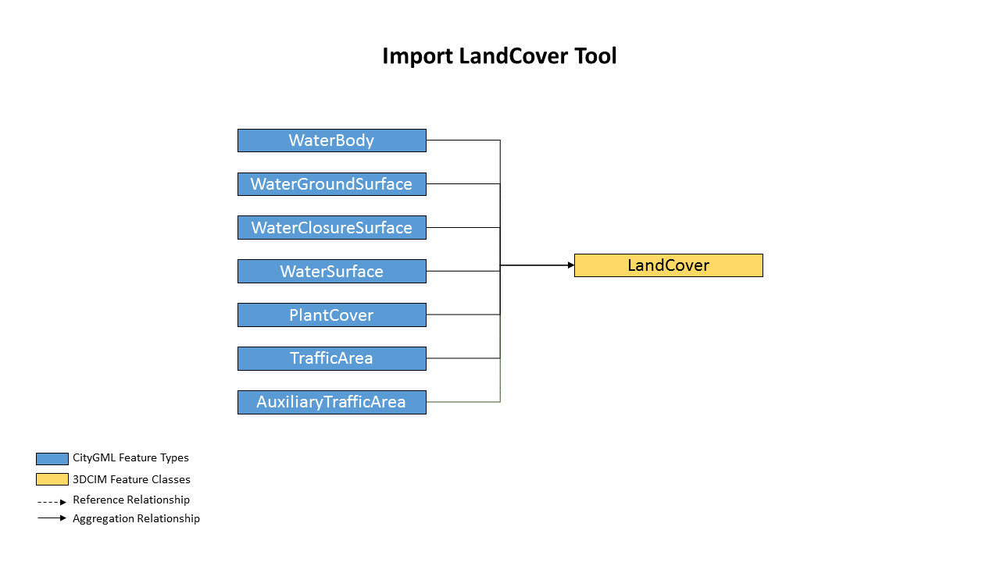

# Import and Export CityGML Data
CityGML is widely used around the world for storing and exchanging virtual 3D city models.  CityGML is a common semantic information model for the representation of 3D urban objects that can be shared over different applications.   The targeted applications are city planning, architectural design, tourist and leisure activities, environmental simulation, mobile telecommunication, disaster management, homeland security, real estate management, vehicle and pedestrian navigation, and training simulators.   A 3D city information model (3DCIM) organizes this 3D data for these applications into three themes: the Built Environment, the Legal Environment, and the Natural Environment. With the 3DCIM, 3D city models can be brought into ArcGIS, ArcScene, and CityEngine and be used for a wide range of applications.    Therefore, Interoperability between CityGML and 3DCIM platforms is essential to achieve all the solution capabilities of the 3D Cities environment.  

In this workflow, you will learn how to use the tools which will be used for interoperability between CityGML files and the 3DCIM:

* Import CityGML modules into the 3DCIM environment
* Export 3DCIM features back into CityGML modules 

## Here's What You Need

Start by gathering the items listed below and following the steps in the directions. More detailed information is provided for each step:

* ArcGIS Desktop 10.2.2
    * Data Interoperability Extension 10.2.2 or FME© Desktop 2014 
* City GML 1.0 or 2.0 source data
    * For samples of CityGML data that you can use in the workflow go to [Sample CityGML    Data](http://www.citygml.org/index.php?id=1539)
* 3D Cities Template
    * Download the CityGML Import and Export Toolbox at [3D Cities Template](https://github.com/Esri/3d-cities-template) and save the toolbox to a local folder on your computer.
    * Download the current XML Workspace Document from [XML Workspace Document](https://github.com/Esri/3d-cities-template/tree/master/InformationModel).

## Directions

In this section:

* Step 1: Install the **3DCIM CityGML Toolbox**
* Step 2: Validate CityGML files ETL Tool
* Step 3: Import CityGML modules into the 3DCIM
* Step 4: Export 3DCIM files into CityGML modules

## Step 1: Install the 3DCIM CityGML toolbox

After you have downloaded the 3D Cities template, activate the Data Interoperability Extension.

1. Start ArcCatalog.
2. In the Menu bar choose Customize> Extensions and check Data Interoperability.

Next, we will add the **3DCIM CityGML Toolbox** to our toolboxes. 

1. In ArcCatalog, go to the location you saved the 3D Cities Template.
2. Open up Workflows>3DCityMaintenance>CityGML Tools.

Open the **3DCIM CityGML Toolbox** and you will see that it contains three different toolsets.  

* **CityGML Export Toolset**
* **CityGML Import Toolset**
* **Helper Tools Toolset**
 
## Step 2: Validate CityGML files ETL Tool 

In order for the **3CDIM CityGML Toolbox** to work, all CityGML files must be validated before use.  To do this, you will use the **Validate CityGML** files tool.  For more information on valid CityGML schema’s Versions 1.0 and 2.0 OGC please visit [Validate CityGML Data](http://www.opengeospatial.org/standards/citygml).  To validate your CityGML files do the following:

1. Open the **Helper Tools toolset**.
1. Open the **Validate CityGML files**.

This tool will verify that the Schema is correct for migrating into the 3DCIM.  If the data is not valid the **3DCIM CityGML Toolbox** will not work.  Some common reasons for invalid data are:

* Texture errors
* Undefined spatial reference
* Missing attributes

## Step 3: Import CityGML modules into the 3DCIM

In this step, you will import valid CityGML files into the 3DCIM environment using the **CityGML Import** toolset.  When you open the toolset you will see that it has the following ETL tools:

* **Import Building**
* **Import Building LoD 1 and 2**
* **Import CityFurniture**
* **Import LandCover**
* **Import LandUse**
* **Import SolitaryVegetationObject**

We will next discuss each of these tools in further detail.

* **Import Building** – imports CityGML *Building* module containing the feature types of LoD1 *Building*; LoD2 *GroundSurface*, *WallSurface*, and *RoofSurface*; LoD3 *BuildingInstallation*; LoD4 *InteriorWall*, 
*IntBuildingInstallation*, and *Room* into the 3DCIM with feature classes *Building*, *BuildingShell*, *BuildingShellPart*, *BuildingInteriorStructure*, *BuildingInstallation*, and *BuildingInteriorSpace*.

### Example: Import CityGML ***Building*** module into the 3DCIM 
Now, we will use the **Import Building** tool as an example to illustrate how the import tools work.  To open, double-click the tool (or right-click and choose Open). 

**Source CityGML File(s):** Select CityGML file(s) to process.

**GML SRS Axis Order (optional):** In some cases (when the coordinate system is not defined or unknown) it might be necessary to define the axis order. 1, 2, 3 corresponds to an axis order of x, y, z.

**Ingnore xsi:schemaLocation in Dataset (optional):** Choose Yes in case the CityGML file contains local schema definitions.

**Destination Esri File Geodatabase:** Choose the name and location for the destination 3DCIM Geodatabase. Create a new 3DCIM Geodatabase or choose an existing one.

**XML Workspace Document (optional):** In case a new 3DCIM Geodatabase should be created, choose the XML Workspace Document you find in the examples folder.

**Overwrite Existing Geodatabase:** Choose Yes in case an existing 3DCIM Geodatabase should be overwritten. In this case, also enter the location path of the XML Workspace Document under XML Workspace Document.

The Output is a *Building* feature class in the 3DCIM with new aggregated CityGML modules.

 

Here are the other CityGML import tools in detail:

* **Import Building LoD 1 and 2**  -imports CityGML LoD1 and LoD2 feature types into the 3DCIM with feature classes *Building*, *BuildingShell*, and *BuildingShellPart*.

* **Import CityFurniture** - imports CityGML *CityFurniture* module into the 3DCIM with feature classes *StreetFurniture*, *SpatialLineAnnotation*, and *SpatialVolumeAnnotation*.

* **Import LandCover** - imports CityGML *LandCover* module containing the feature types *WaterBody*, *WaterGroundSurface*, *WaterClosureSurface*, *WaterSurface*, *PlantCover*, *TrafficArea*, and *AuxiliaryTrafficArea* into the 3DCIM feature class *LandCover*.

* **Import LandUse** -imports CityGML *LandUse* module into the 3DCIM with feature classes *ZoningDistrict*, *Attribute Container*, and *Usage*.

* **Import SolitaryVegetationObject** - imports CityGML *SolitaryVegetationObject* module into the 3DCIM with feature classes *Tree*, *AttributeContainer*, and *SpatialVolumeAnnotation*.

## Step 4: Export 3DCIM files into CityGML modules

In this step, you will export 3DCIM features back into CityGML modules using the **CityGML Export** toolset.  When you open the toolset you will see that it has the following ETL tools:

* **Export Building** -  exports 3DCIM feature classes *Building*, *BuildingShell*, *BuildingShellPart*, *BuildingInteriorStructure*, *BuildingInstallation*, and *BuildingInteriorSpace* into CityGML *Building* module.
* **Export CityFurniture**- exports 3DCIM feature classes *StreetFurniture*, *SpatialLineAnnotation*, and *SpatialVolumeAnnotation* to CityGML *CityFurniture* module. 
* **Export LandCover** - exports 3DCIM *LandCover* feature class to the CityGML AuxiliaryTrafficArea*, *TrafficArea*, *PlantCover*, * WaterBody*, *WaterGroundSurface*, *WaterClosureSurface*, and *WaterSurface* modules.
* **Export LandUse** -exports 3DCIM feature classes *ZoningDistrict*, *Attribute Container*, and *Usage into CityGML *LandUse* module. 
* **Export SolitaryVegetationObject** - exports 3DCIM with feature classes *Tree*, *AttributeContainer*, and *SpatialVolumeAnnotation* into CityGML *SolitaryVegetationObject* module.

In the next example, we will use the **Export Building** tool.  To open, double-click the tool (or right-click and choose Open).  

**Source Esri File Geodatabase:** Choose the 3CDIM Geodatabase to from where to export CityGML file(s).

**CityGML Version:** Choose between CityGML Version 1.0 or 2.0. 

**Export with Building Footprint (CityGML 2.0 only):** CityGML 2.0 introduced a new geometry called LoD0FootPrint (a 2.5 polygon describing the building footprint). Choose Yes in case footprints should be exported.

**Destination CityGML Document:** Choose the folder and name for the CityGML file. 

**CityGML Name (gml:name) (optional):** Assign a CityGML CityModel name.

**CityGML description (gml:description) (optional):** Enter a CityGML CityModel description.

The Output is now CityGML data with 3DCIM feature classes aggregated back into CityGML modules.

###3DCIM CityGML ETL Tools Customization 

Since all CityGML Import and Export Tools are based on ETL Tools it is possible to customize them. To do this, right-click on the tool and choose Edit.  Please note that an advanced knowledge of FME is required to customize the tools.

